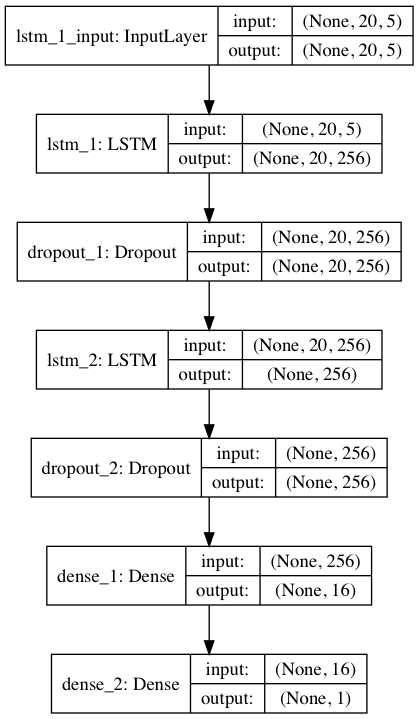
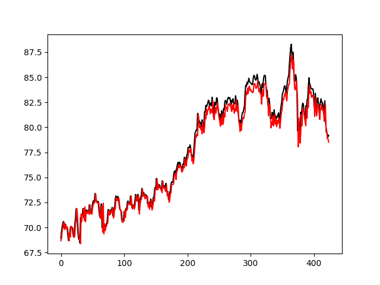
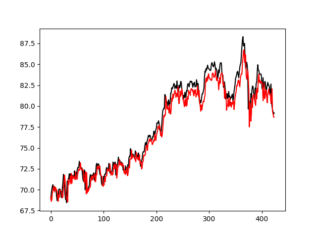
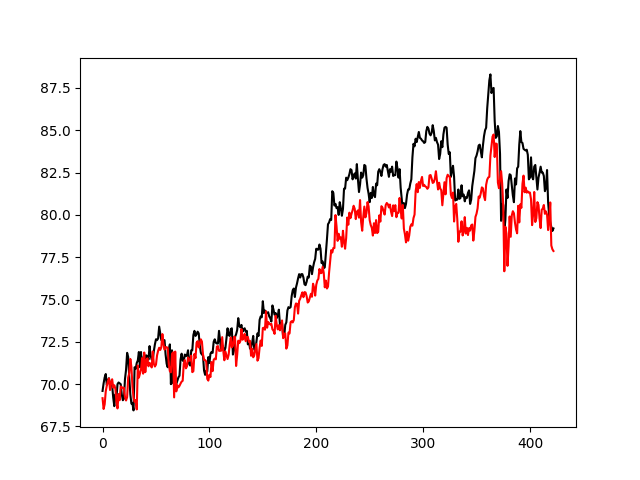
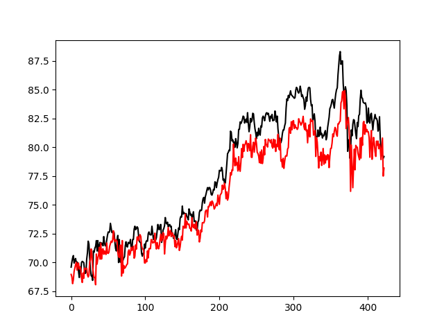
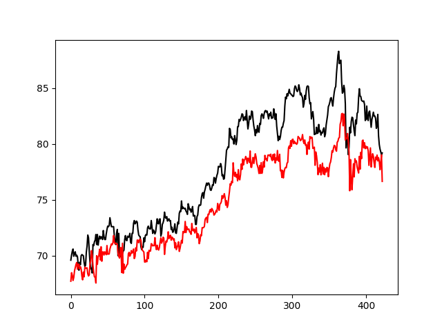

# Predicted stock price
預測未來一週收盤價，目前嘗試了兩種model
1. ```many-to-one 預測未來一天```
2. ```many-to-one 分別預測未來1~5天```

## Model

### 1. many-to-one 預測未來一天



### 2. many-to-one 分別預測未來1~5天


## Data
    data form: (N, 20, 1)
    tainind & validate: 2/3(train), 1/3(validate)

## Usage

```bash
& pip3 install -r requirements.txt
```

* many-to-one 預測未來一天

```bash
& python3 test_lstm.py
```

* many-to-one 分別預測未來1~5天

```bash
& python3 test_lstm_2.py
```

## Result

* many-to-one 預測未來一天

    以下為 ```0050```預測下一天之結果，
    上面為`training data`,下面為`validate data`
    

* many-to-one 分別預測未來1~5天

    以下為 ```0050``` 分別預測第一到第五天

    * 第一天
    

    * 第二天
    

    * 第三天
    

    * 第四天
    

    * 第五天
    
