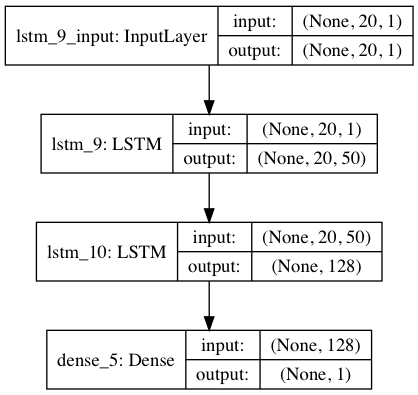
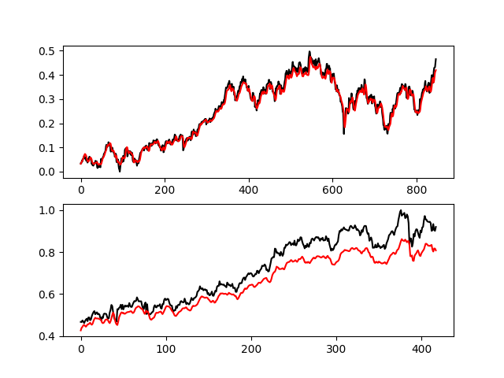

# Predicted stock price
使用前三十天收盤價預測下一天收盤價

## Model


## Data
    data form: (N, 30, 1)
    tainind & validate: 2/3(train), 1/3(validate)

## Usage

```bash
& pip3 install -r requirements.txt
& python3 test-lstm.py
```

## Result
上面為`training data`,下面為`validate data`



