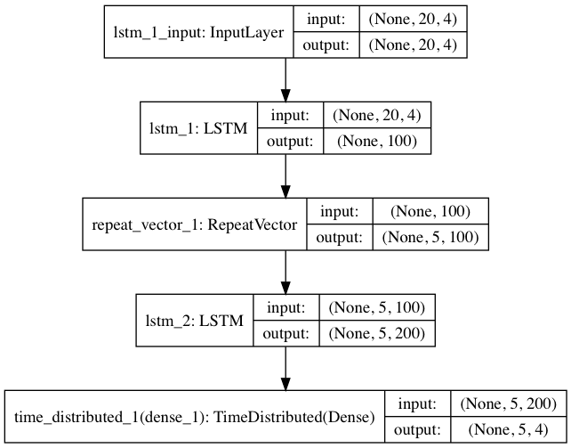
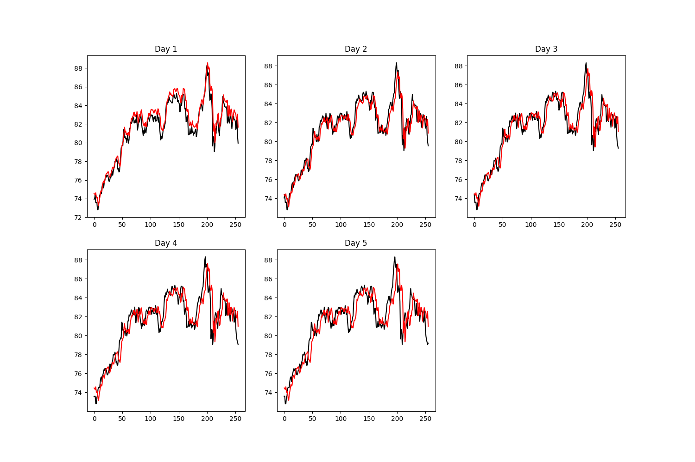
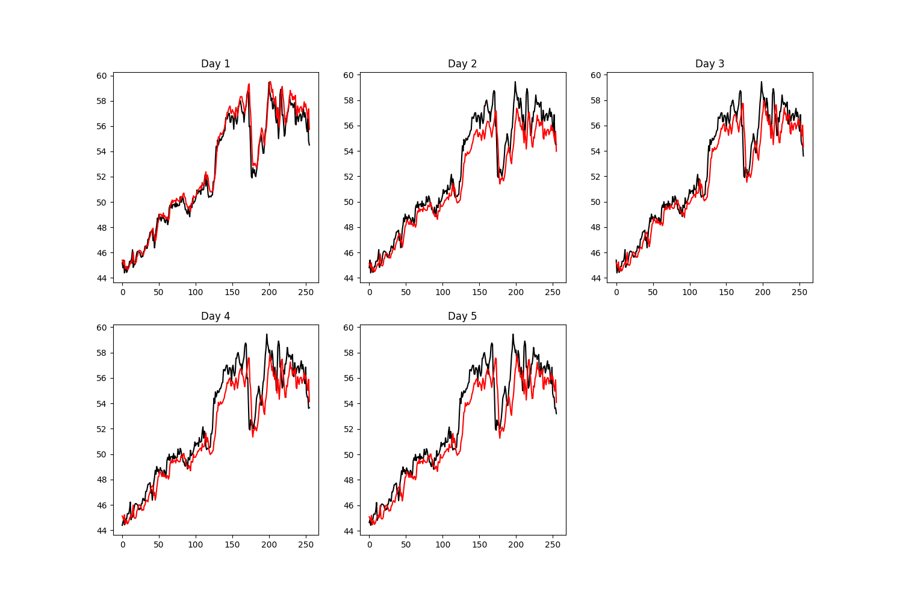
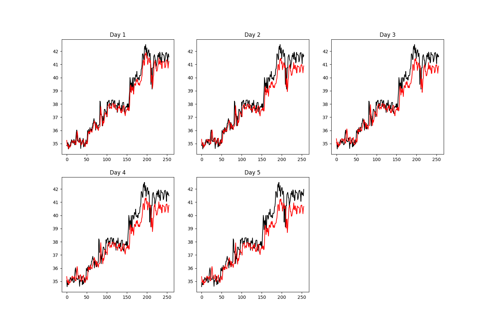
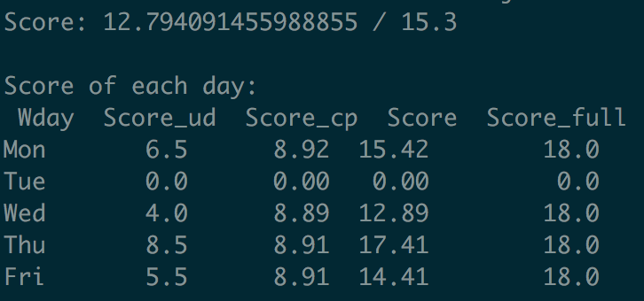
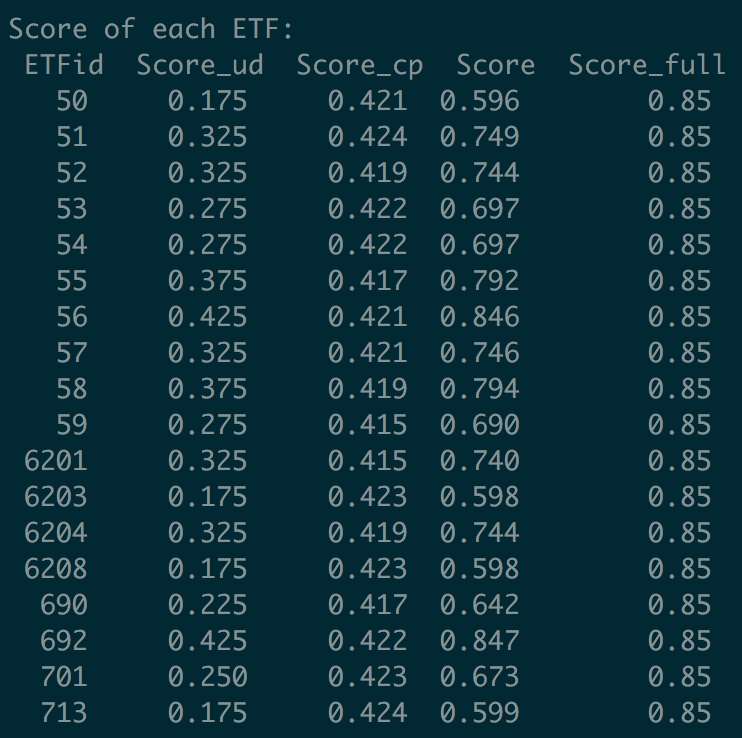
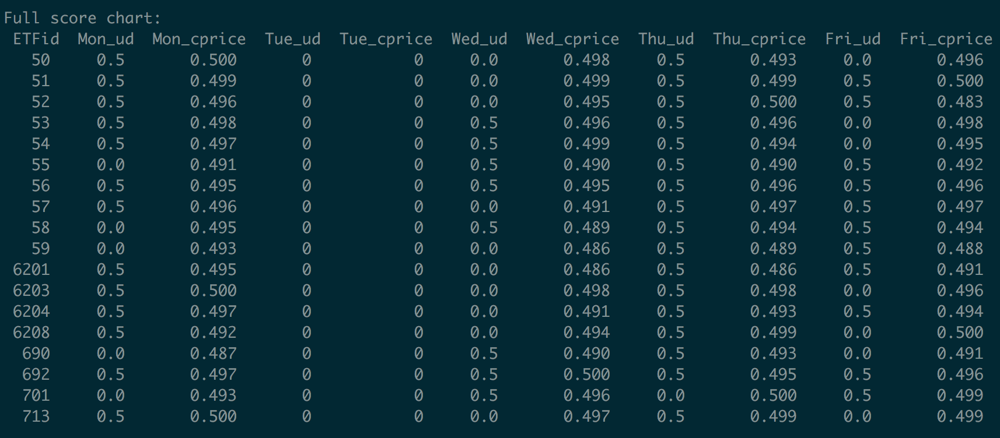

# Predicted stock price
預測未來一週收盤價，目前嘗試了兩種model
1. ```many-to-one 預測未來一天```（結果不好又要train很久，放棄)
2. ```many-to-one 分別預測未來1~5天``` (同上)
3. ```many-to-many 直接預測未來5天```
4. ```seq2seq```
5. ```seq2seq + attention```

## Model
### many-to-many 直接預測未來5天



## Data
    data form: (N, 20, 1)
    tainind & validate: 80:20

## Usage

```bash
& pip3 install -r requirements.txt
```

* many-to-many 直接預測未來5天

```bash
& python3 lstm_mtm.py
```

## Result

* many-to-many 直接預測未來5天

    #### 0050
    

    #### 0052
    

    #### 0059
    

## Score

* many-to-many 直接預測未來5天

    #### current score: ```12.79```

    #### Score of each day
    

    #### Score of each ETF
    

    #### Total Score
    
